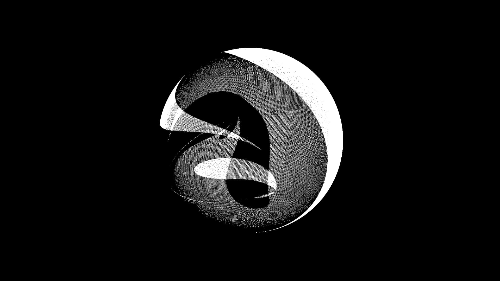

# Zhizhwa - Dancing Forms

- Tìtulo : Zhizhwa
- Autor: A1V8
- Año: 2025

Es una forma que se redibuja a cada frame, en cada instante, solo existe en el presente sin pasado ni memoria; se está sobreescribiendo cada vez que la pantalla se refresca. Lo que acabas de ver ya no existe, fue ejecutado una sola vez en la tarjeta gráfica y luego desapareció.

### Acerca de
A1V8 es un proyecto artístico que investiga la imagen interactiva en tiempo real mediante programación gráfica. Nos interesa crear experiencias estéticas desde el código, explorando el potencial expresivo de la tecnología como lenguaje visual. Buscamos promover la producción de proyectos web o no-web que integren propuestas visuales e interactivas.

### Contacto
- [Instagram](https://www.instagram.com/_a1v8/)

© 2025 A1V8

